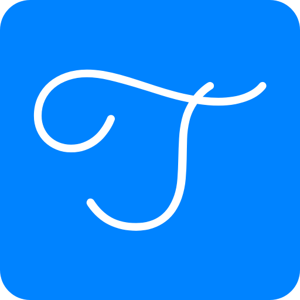
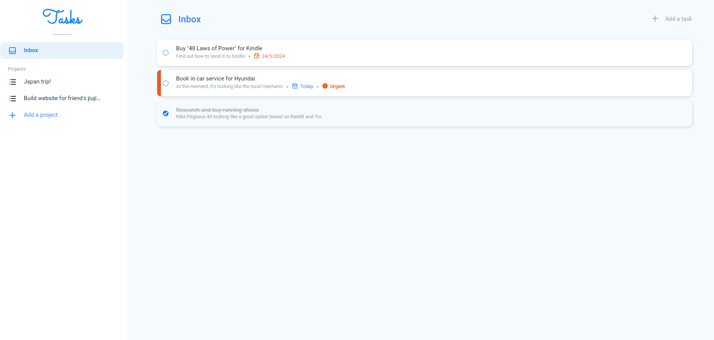
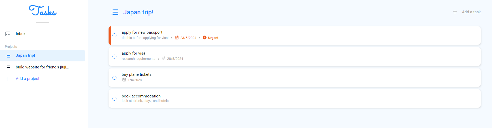
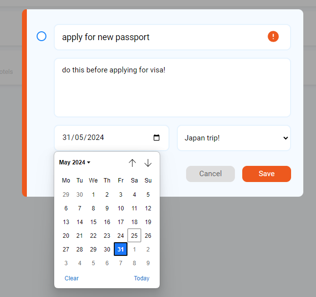
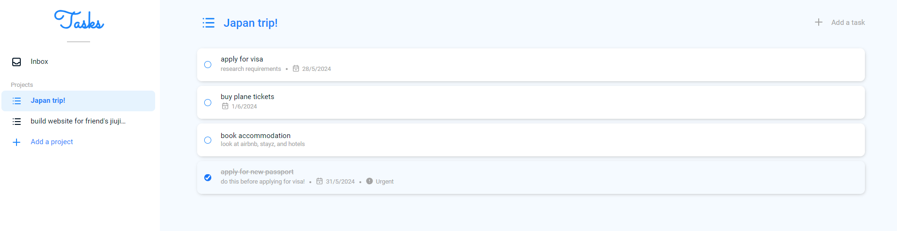

[![MIT License][license-shield]][license-url]
[![LinkedIn][linkedin-shield]][linkedin-url]
 
 

    
    <a href="https://henrylin.io/tasks"><h3 align="center">Tasks</h3></a>
    
Vanilla-JS web app to help you manage your to-dos

## About

Use Tasks as your to-do list for work, personal life, family and anything else you need and want to get done.

Tasks uses persistent storage. This means your data is saved even if you close your tab/browser.

### Technologies

## Usage

Once **[Tasks](https://henrylin.io/tasks)** loads, you should see a list of tasks in your inbox or, if it's your first time, a blank inbox.

Your inbox stores once-off tasks, and any tasks you haven't categorised yet into a "project". A project is a collection of tasks that all try and achieve the same goal. For example, you might have a project called "Japan trip" and lists out all the tasks you need to do before you holiday there. You can see all of your projects to the left.

You can expand any tasks by clicking on it. In the popup, you can also edit any of the details as things evolve.

    

 

Once a task is done, you can tick the checkbox, and the tasks will go to the bottom of your inbox or project.

## Contributing

If you have a suggestion that would make Tasks better, please feel free to add an issue and/or fork and create a pull request.

## License

Distributed under the MIT License. See `LICENSE.txt` for more information.

## Acknowledgements

* Wireframes and diagrams completed in [draw.io](https://app.diagrams.net/)
* All icons were by [tabler icons](https://tabler.io/icons)
* Colour palette suggestions by [ColorSpace](https://mycolor.space/)
* The present README file was heavily influenced by the ["Best-README-Template"](https://github.com/othneildrew/Best-README-Template)
* Favicon was generated by [favicon.io](https://favicon.io)
* Thank you to [The Odin Project](https://www.theodinproject.com/) community on Discord

[license-shield]: https://img.shields.io/github/license/henrylin03/tasks.svg?style=flat
[license-url]: https://github.com/othneildrew/Best-README-Template/blob/master/LICENSE.txt
[linkedin-shield]: https://img.shields.io/badge/-LinkedIn-black.svg?style=social&logo=linkedin&colorB=555
[linkedin-url]: https://www.linkedin.com/in/henrylin03/
