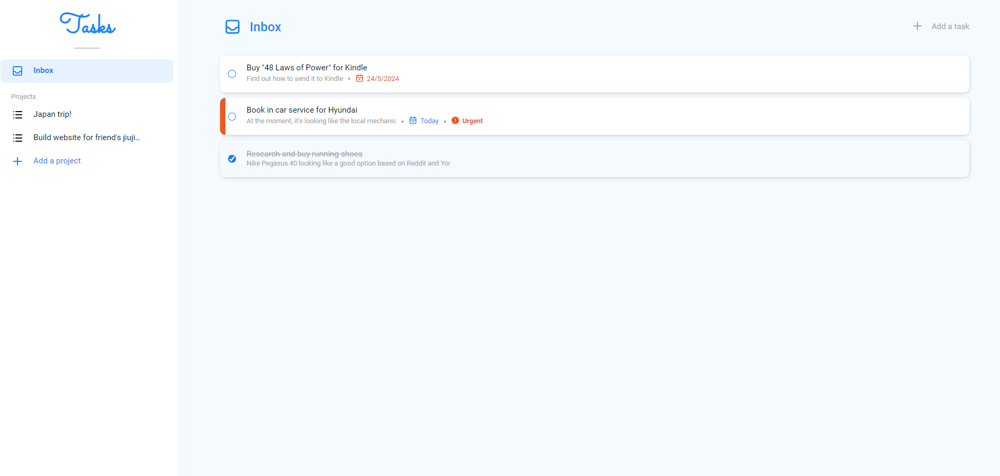

 

    
    <a href="https://henrylin.io/tasks"><h3 align="center">Tasks</h3></a>
    
Vanilla-JS web app to help you manage your to-dos

## About

Use Tasks as your to-do list for work, vacation, family and anything else.

Track what needs to be done, what has been done, and by when.

The web app uses persistent storage. This means that your data is saved even if you close your tab/browser.

### Technologies

## Usage

### Adding a project

### Adding a task

### Renaming a project

### Modifying a task

### Completing a task

### Deleting a task

### Deleting a project

## Contributing

## License

## Contact

## Acknowledgements
